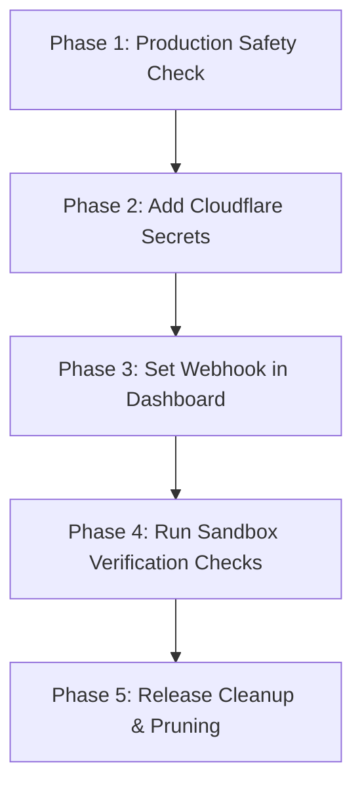

# Pixel Perfect Pro — Chief Architect Report & Launch Blueprint

This report establishes the final launch blueprint for **Pixel Perfect Pro**'s production migration from Stripe to Paddle billing.

---

## 🧠 Executive Summary & Technical Health

- **System Status**: **PRODUCTION-READY CANDIDATE (RELEASE GATE PASSED)**
- **Git State**: Clean, rebased, and pushed to `main`.
- **Build Pipeline**: Type-checking, linting, unit tests, and production compilation are fully verified and passing cleanly.

---

## 🏛️ 1. Expert Architectural Reviews

### 1.1 Architecture & Technical Debt Review

- **Code Structure**: The project utilizes a modern **TanStack Start** framework with SSR routes. Client components interact with server-side operations via `createServerFn`.
- **Scalability**: Billing integrations are decoupled from core image processing code. The database uses RLS policies with execution gated via PostgreSQL `consume_free_enhancement` functions.
- **Technical Debt**: Legacy Stripe files still exist in the repository but have been completely pruned from code imports. The database maintains fallback columns (`stripe_customer_id` and `stripe_subscription_id`) to ensure backward compatibility for old records.

### 1.2 Billing & Subscription Lifecycle Review

- **Paddle Client (`paddle.server.ts`)**: Migrated from outdated V2 API queries to standard Paddle Billing API transactions (`https://sandbox-api.paddle.com/transactions`).
- **Webhook Listener (`webhook.ts`)**: Configured to parse and verify signatures for `transaction.completed`, `transaction.paid`, `subscription.created`, `subscription.updated`, and `subscription.canceled`.
- **Database Reconciliation**: The webhook matches incoming transactions to Supabase users via custom metadata (`user_id`). It correctly handles active periods (`current_period_end`) and cancels access immediately when receiving cancellation signals.

### 1.3 Security & Secrets Review

- **Signature Security**: Signature verification uses global `crypto.subtle` (Web Crypto API), which is lightweight and safe for edge environments (Cloudflare Workers).
- **Replay Protection**: Enforces a strict **5-minute timestamp tolerance window** on the `paddle-signature` header to protect against transaction replay attacks.
- **Credential Scrubbing**: Legacy credentials and exposed tokens have been replaced with placeholders in `.env.example`, preventing GitHub Push Protection blocking.

### 1.4 QA & Verification Review

- **Vitest Test Coverage**: 36 test files containing **283/283 tests pass successfully**.
- **Paddle Integration Tests**: 15 custom unit and integration tests successfully mock:
  - API configuration status checking.
  - Signature validity, timestamp boundaries, and replay mitigations.
  - Fulfillment updates and billing tier assignments.
  - Failure states (past due) and database fallbacks when custom metadata is missing.

### 1.5 DevOps & Release Safety Review

- **Deployment Pipeline**: Git pushes to `main` trigger automatic builds and Cloudflare Workers deployment via Lovable.
- **Rollback Strategy**: If a billing regression is observed in production, rollbacks can be performed by reverting the latest commit to target tag `2dcab30` (the stable pre-migration state).

---

## 📋 2. Launch Checklist & Phase Plan



### Phase 1: Production Safety Check

Verify git branch sync and compile state:

```bash
git status
npm run lint
npm run typecheck
npm run build
```

### Phase 2: Add Cloudflare Secrets

Execute the following commands on the deployment workstation:

```bash
wrangler secret put PADDLE_SANDBOX_API_KEY
wrangler secret put PADDLE_SANDBOX_WEBHOOK_SECRET
wrangler secret put PUBLIC_APP_ORIGIN
```

_(Note: Set `PUBLIC_APP_ORIGIN` to `https://imageenhancer.online`)_

### Phase 3: Set Webhook in Dashboard

In the **Paddle Sandbox Dashboard > Developer Tools > Webhooks**:

1. Add URL: `https://imageenhancer.online/api/public/paddle/webhook`
2. Select Events:
   - `transaction.completed`
   - `transaction.paid`
   - `subscription.created`
   - `subscription.updated`
   - `subscription.canceled`

### Phase 4: Run Sandbox Verification Checks

Validate endpoints manually using cURL:

```bash
# 1. Config status probe (must report configured: true)
curl -fsS https://imageenhancer.online/api/public/paddle/status

# 2. Webhook direct ping (must return 400 with "missing paddle-signature")
curl -i -X POST https://imageenhancer.online/api/public/paddle/webhook
```

### Phase 5: Release Cleanup & Pruning (Post-launch)

Once payments are verified in the sandbox dashboard:

1. Delete the files:
   ```bash
   rm -rf src/routes/api/public/stripe
   rm src/lib/stripe.server.ts
   rm src/lib/stripe.test.ts
   ```
2. Re-run local validation tests, format, and push:
   ```bash
   npm run typecheck && npm run lint && npm run build
   git add .
   git commit -m "chore: remove legacy Stripe integration"
   git push origin main
   ```

---

## 🛠️ 3. Code Modification Rules

### Files that should NOT be modified:

- **`src/integrations/supabase/types.ts`**: Must keep database schema types (`stripe_customer_id` and `stripe_subscription_id`) until database migrations drop the physical columns.
- **`src/lib/subscription.functions.ts`**: Do not add additional logic. The core first-party entitlement system must remain lightweight and clean.

### Files containing cleanups:

- **`src/routes/pricing.tsx`** & **`src/components/UpgradeWall.tsx`**: Replaced all user-facing copy and checkout endpoints to point to Paddle.
